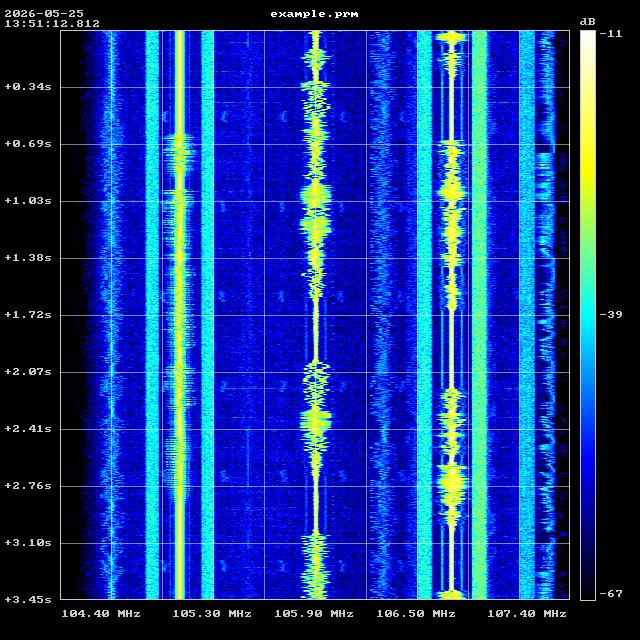
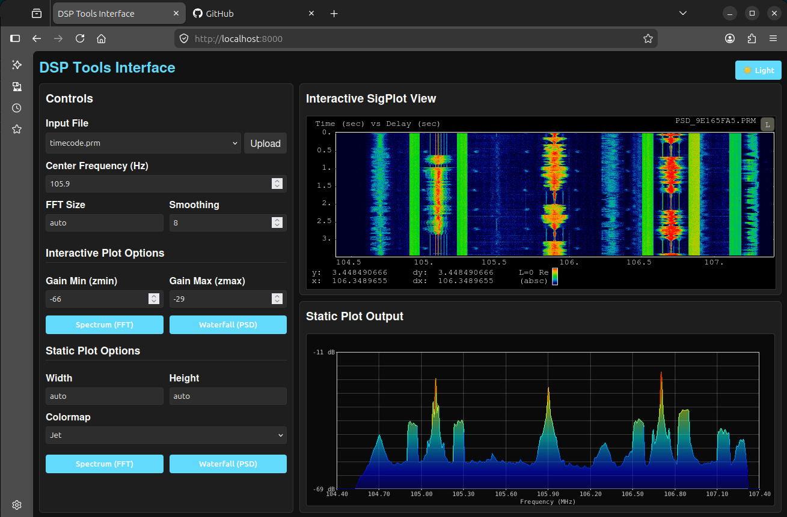

# DSP Tools



A high-performance C++ suite of tools for processing, manipulating, and visualizing complex and real signals (including SigMF, X-Midas Blue, and standard WAV files). It is designed to be highly memory-efficient through streaming data via `mmap()` and fast by offloading heavy math to the SIMD-accelerated KFR framework. 

## Features

- **Blazing Fast**: Uses KFR for vectorized FFT operations and filtering.
- **Low Memory Footprint**: Processes large signal data input efficiently via memory mapping (`mmap()`).
- **Flexible Formats**: Native auto-detection and support for SigMF (`.sigmf-meta`/`.sigmf-data`), X-Midas Blue (`.prm`/`.tmp`), and standard WAV files (Real or Complex/IQ).
- **Time/Frequency Slicing**: Tools support processing specific time durations and dynamically zooming into narrow slivers of the spectrum via digital down conversion (DDC).

## Build Instructions

This project is built using CMake and requires a modern C++ compiler (C++17 or newer).

### Dependencies
All core dependencies (KFR, spdlog, CLI11, stb) are automatically fetched and built using CMake's `FetchContent`. No manual system installations of these libraries are required!

### Compiling

1. Clone or download this repository.
2. Create a build directory:
   ```bash
   mkdir build && cd build
   ```
3. Run CMake and Make:
   ```bash
   cmake ..
   make -j$(nproc)
   ```

After compilation, the binaries will be located in the `build/` directory.

### Testing

The project uses Catch2 for unit testing. To run the tests, simply build the `dsp_tests` target and run it:

```bash
make dsp_tests
./dsp_tests
```

If you wish to generate a code coverage report, run CMake with `-DDSP_TOOLS_COVERAGE=ON`:

```bash
cmake -DDSP_TOOLS_COVERAGE=ON ..
make coverage
```
The HTML coverage report will be available in the `build/coverage/` directory.

## Web Interface (Interactive GUI)

This project includes a modern, browser-based web interface built with **React (Vite)**, **SigPlot**, and a **FastAPI** backend. It provides an interactive GUI to explore, upload, process, and dynamically plot files.

### Building and Running the Web App



You can easily deploy the web interface using Docker. The Dockerfile uses a multi-stage build to compile the C++ tools, bundle the React frontend, and launch the FastAPI server.

```bash
# 1. Build the Docker image
docker build -t dsp_web .

# 2. Run the container
# We mount your local build directory to /app/data so you can drag and drop .prm files!
docker run -p 8000:8000 -v $(pwd)/build:/app/data dsp_web
```

Once running, navigate to `http://localhost:8000` in your browser. 

**Features:**
- **Interactive Waterfall & Spectrum Plots**: Leverages `sigplot` to render backend `dsp_fft` and `dsp_psd` generated X-Midas `Type 2000` bluefiles for hyper-fast interactive canvas navigation (zoom, pan, gain adjustment).
- **Static HD Plot Generator**: Export high-resolution JPEGs/PNGs via `dsp_plotter` directly from the UI.
- **Dynamic DSP Adjustments**: Toggle colormaps (Jet, Grape, Turbo), configure FFT size & time-smoothing, and flip between Light and Dark themes.

## Tools Overview
### 1. `dsp_plotter` (High-Performance Spectral Plotter)

Generates FFT spectrum and waterfall image plots from signals. It uses STB for rapid PNG/JPG encoding and supports dynamic zooming, channelization, and bounding-box annotations.

```bash
# Generate a fast waterfall plot of an entire SDR recording
./dsp_plotter -i my_recording.wav

# Explicitly request both FFT and Waterfall plots
./dsp_plotter -i my_recording.wav --plot-fft --plot-waterfall

# Zoom into a 0.4 MHz sliver centered exactly at 105.9 MHz
./dsp_plotter -i sdrplay_105.1MHz.wav --center-freq 105.1 --zoom-center 105.9 --zoom-bw 0.4

# Draw a red highlight box over a specific signal
./dsp_plotter -i my_recording.wav --box-start-time 1.5 --box-duration 2.0 --box-center-freq 105.9 --box-bw 0.2 --box-color red
```

### 2. `dsp_whitener` (Hybrid Interference Reducer)

A two-stage time-domain and frequency-domain interference reduction tool. It features a Time-Domain Pulse Blanker to eradicate radar pulses, and a Frequency-Domain Spectral Whitener to crush persistent narrow-band interference (CW tones) using a dynamic spectral AGC.

It supports two modes:
- **Compress Mode** (`--mode compress`): The default mode for visual plotting. Compresses the dynamic range of the magnitude spectrum using the `--strength` parameter.
- **Leaky Griffiths Mode** (`--mode griffiths`): A mathematically rigorous Adaptive Interference Canceler (Transmultiplexer). Averages the power spectrum and applies a hard regularization threshold using `--excess_leak`, perfectly flattening signals for downstream DSP automated detection.

```bash
# Apply a hybrid whitener/blanker using default compression mode for visualization
./dsp_whitener -i input.prm -o cleaned.prm

# Aggressively flatten the frequency spectrum (strength 1.0 = total flattening)
./dsp_whitener -i input.prm -o flattened.prm --strength 1.0

# Apply a strict Leaky Griffiths Overwhitener with an exponential decay constant of 0.95 and a +5 dB leak threshold
./dsp_whitener -i input.prm -o griffiths.prm --mode griffiths --exp_decay_constant 0.95 --excess_leak 5.0
```

### 3. `dsp_filter` (FIR Filtering Utility)

High-performance FIR filtering utility supporting lowpass, highpass, bandpass, and bandstop filters.

```bash
# Lowpass filter with a 500 kHz cutoff (keeps everything from 0 to 500 kHz)
./dsp_filter -i input.prm -o filtered.prm -t lowpass --cutoff1 500000

# Bandpass filter from 100 kHz to 400 kHz using 2047 taps
./dsp_filter -i input.prm -o filtered.prm -t bandpass --cutoff1 100000 --cutoff2 400000 --taps 2047
```

### 4. `dsp_tuner` (Digital Down Converter)

Tunes to a target center frequency (shifting it to 0 Hz baseband) and optimally decimates the signal. The output sample rate is automatically set to the target bandwidth, guaranteeing an optimal anti-aliasing lowpass filter.

```bash
# Tunes to 1.5 MHz and extracts a 500 kHz bandwidth. Output decimated to 500 kSps.
./dsp_tuner -i input.prm -o tuned.prm -c 1500000 -b 500000
```

### 5. `dsp_resample` (Arbitrary Resampler)

High-performance arbitrary sample rate converter for real and complex files.

```bash
# Resample to exactly 4.0 MHz (calculates interp/dec automatically)
./dsp_resample -i input.prm -o resampled.prm -r 4000000
```

### 6. `dsp_format` (Signal Formatting Utility)

High-performance formatting utility to convert between real and complex data types, and to cast between primitive types (e.g., float to double or int16).

```bash
# Convert a real signal to an analytic complex signal using a Hilbert transform filter
./dsp_format -i real.prm -o analytic.prm --to-complex --method hilbert

# Demodulate a real passband signal (centered at Fs/4) to complex baseband (0 Hz)
./dsp_format -i if_real.prm -o baseband.prm --to-complex --method pack

# Extract the magnitude from a complex signal (e.g., for AM demodulation)
./dsp_format -i complex.prm -o magnitude.prm --to-real --extract mag

# Cast a 32-bit float file (SF) to a 64-bit double file (SD)
./dsp_format -i float.prm -o double.prm --cast D
```

## Acknowledgements & Third-Party Code

This project relies on several fantastic open-source projects and code snippets:

- **KFR** (https://github.com/kfrlib/kfr): A fast, modern C++ DSP framework (dual-licensed, used under GPLv2+).
- **stb_image_write.h** & **stb_truetype.h** (https://github.com/nothings/stb): Public domain single-file libraries by Sean Barrett used for rapid PNG/JPEG encoding and TrueType vector font rasterization.
- **CLI11** (https://github.com/CLIUtils/CLI11): Command line parser for C++11 and beyond (BSD 3-Clause).
- **spdlog** (https://github.com/gabime/spdlog): Fast C++ logging library (MIT License).
- **nlohmann_json** (https://github.com/nlohmann/json): JSON for Modern C++ (MIT License).
- **pybind11** (https://github.com/pybind/pybind11): Seamless operability between C++11 and Python (BSD 3-Clause).
- **FastAPI & Uvicorn** (https://fastapi.tiangolo.com/): High performance Python web framework used for the backend (MIT License).
- **React & Vite** (https://react.dev/ / https://vitejs.dev/): Frontend UI library and next-generation frontend build tooling (MIT License).
- **SigPlot** (https://github.com/LGSInnovations/sigplot): A web-based interactive signal plotting library by LGS Innovations for rendering complex DSP data and X-Midas Type 2000 bluefiles natively in the browser.

## Licensing

This project is licensed under the **GNU General Public License v3.0 (GPLv3)**. 
Because this software links against and uses the KFR DSP library (which is dual-licensed and released under GPLv2+ for open source projects), this project inherits those copyleft requirements. See the `LICENSE` file for more details.
